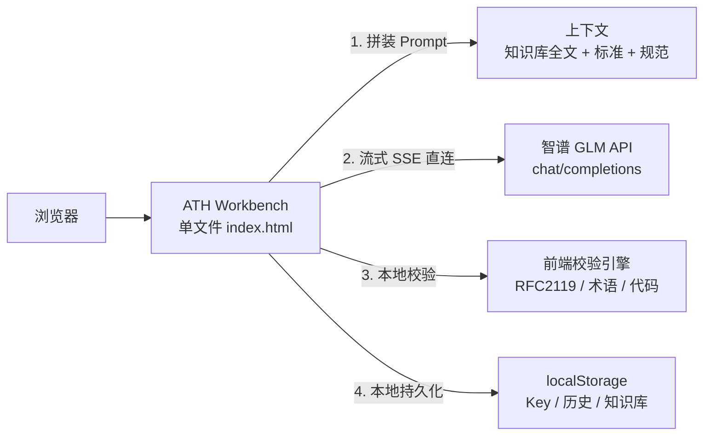

<div align="center">

# ATH Workbench

**Agent Trust Handshake — 智能体信任握手协议 · 协作工作台**

让协议从「文档」变成「可操作的流程」——一个**零后端、零部署、零泄露风险**的 AI 协作工作台，
覆盖协议的 **标准撰写、代码生成、智能答疑** 三大工程场景。

> 📖 配套文档：[ATH 协议知识库](ATH知识库.md) · 协议设计思路思维导图


-red)


**一行话**：`index.html` 就是全部 —— 打开即用，永不泄露你的 API Key。

</div>

---

## ✨ 是什么

ATH（Agent Trust Handshake）是一个开源协议，为智能体（Agent）之间的**双向授权与细粒度信任**
定义了一套可验证的握手机制，弥补传统 OAuth 只解决「用户同意」、不验证「Agent 是否可信」的缺口。

**ATH Workbench** 是围绕这套协议打造的 AI 协作工作台。它不是一个产品 Demo，而是
*「如何用 AI 来撰写、实现、讲解 ATH」* 的完整工作流演示：

| 模式 | 场景 | 视觉标识 |
|---|---|---|
| 📝 标准撰写 | 用 AI 起草、修订协议规范章节 | 蓝 `#4e6ef2` |
| 💻 代码生成 | 用 AI 生成协议各语言的实现代码 | 橙 `#ed7d31` |
| 💬 智能答疑 | 基于协议知识库回答技术问题 | 绿 `#10b981` |

三种模式共用一套三栏工作台：**左栏配置 Prompt 输入 → 中栏流式生成 → 右栏自动校验**，
生成内容可一键采纳、二次编辑、重新生成。

---

## 💡 为什么是纯前端：轻量化即正义

> 这不是「做不了后端」的妥协，而是**刻意选择的架构**——在需求边界内，把复杂度降到绝对最低。

### 一文件主义

整个应用是**一个 79KB 的 `index.html`**：零依赖、零构建、零打包、零 `node_modules`。
前端框架、构建链、包管理器统统不需要。任何一个能打开网页的设备都能跑。

### 部署 = 复制一个文件

| 部署方式 | 成本 | 耗时 |
|---|---|---|
| 双击打开（file://） | ¥0 | 0 秒 |
| GitHub Pages / 任意静态托管 | ¥0 | 1 分钟 |
| 微信云托管 / 云开发静态托管 | 按量或免费额度 | 5 分钟 |
| 局域网共享 / U 盘拷贝 | ¥0 | 0 秒 |

没有服务器要配置，没有环境变量要维护，没有半夜的宕机警报。**「部署」这个词在这个项目里退化成「复制粘贴」。**

### 三个关键决策，让零后端成立

1. **知识库只有 14.8KB（20 章）** → 无需向量检索，全文塞入 prompt 即可（约 8K tokens），
   比「检索-排序-注入」更简单、效果更好——这是能砍掉数据库的根本原因
2. **校验本来就是前端职责** → RFC 2119 关键词统计、术语一致性比对，一段正则即可完成，
   不需要为「高亮一个 MUST」起一台服务器
3. **API Key 各填各的** → 浏览器直连模型官方 API，key 不经过任何中转服务器（详见下文安全设计）

### 轻量化的边界：什么时候该加后端

纯前端不是银弹，这个项目划清了清晰的边界——当出现以下信号时，才值得引入后端：

- 知识库增长到数 MB、需要分章节向量检索
- 多用户、团队共享知识库与历史记录
- 需要审计日志、权限体系、CI/CD 真实集成

到那时，`index.html` 的架构天然可以平滑演进（API 层早已抽象为可替换的端点）。

---

## 🔐 安全设计：API Key 零泄露

开源项目的宿命是：**代码全世界可见**。所以本项目把「key 安全」当成第一公民来设计。
核心原则只有一条：

> **Key 不进入代码，代码里就没有 Key 可泄露。**

### 威胁模型：逐条防御

| 威胁 | 本项目如何规避 |
|---|---|
| 🐛 源码泄露 Key（开源最大风险） | Key **永不写入代码**。运行时由使用者在浏览器里粘贴，存于 `localStorage`。仓库已通过 grep 审计，**零 Key 残留** |
| 🕵️ 第三方服务器截获 Key | **没有第三方服务器**。浏览器直接 `fetch` 智谱官方 API（`open.bigmodel.cn`），请求只发往这一个域名，不存在「中转服务器偷偷记下你的 Key」的可能 |
| 💾 本地存储被盗 | Key 存于浏览器 `localStorage`（同源隔离，其它网站读不到）；输入框 `type=password` 防肩窥截图 |
| 🚦 传输窃听 | 全链路 HTTPS，Key 仅作为 `Authorization: Bearer` 头在加密通道中传输 |
| 🔑 Key 被滥用盗刷 | 免费档模型 `glm-4-flash` 即使泄露损失也可控；智谱控制台可随时一键吊销重建 |

### 为什么「浏览器直连」反而比「后端转发」更安全

直觉上，有后端似乎更安全——恰恰相反：

- **有后端**：每个使用者都要把 Key 交给你的服务器 → 你的服务器变成 Key 的「蜜罐」，一旦被拖库，所有人的 Key 一起完蛋
- **无后端**：Key 只存在于「使用者自己的浏览器 ↔ 官方 API」之间，中间没有任何一方能批量收集 Key

**结论：零后端不仅是架构的简化，更是安全面的最小化。**

### 可验证的安全审计

```bash
# 任何人都可以自己验证：代码里没有任何 Key
grep -r "sk-" .          # 无输出 ✓
grep -r "apiKey\s*=" .   # 只出现在运行时读取逻辑 ✓
```

---

## 🏗️ 架构总览



> ✅ 智谱 GLM 官方 API 已实测支持浏览器 CORS 直连（`Access-Control-Allow-Origin` 回显任意来源、
> `Authorization` 头放行），零代理方案端到端验证通过。

---

## 🚀 快速开始

**零配置，三步跑起来：**

```bash
# 1. 克隆仓库
git clone https://github.com/1515mamingyang-cloud/ath-workbench.git

# 2. 直接打开（或任意静态服务器）
open index.html          # macOS
start index.html         # Windows
# 或：npx serve .
```

```bash
# 3. 填入你自己的 API Key
#    右上角 ⚙️ 模型设置 → 粘贴 Key（https://open.bigmodel.cn 免费注册）
#    → 点「测试连接」→ 开始使用
```

> 🔒 **隐私承诺**：API Key 仅存储在你的浏览器 `localStorage`，本仓库不含、不收集任何密钥。
> Key 由你保管、由你支配，随时可在智谱控制台吊销。

---

## 🧩 功能特性

### 三模式工作流
- **标准撰写**：勾选参考标准（OAuth 2.0 / PKCE / RFC 8707 / MCP / A2A / RFC 2119），
  Prompt 自动拼装，产出协议章节草案
- **代码生成**：选择目标语言（TypeScript / Python / Go）与协议端点，生成实现代码
- **智能答疑**：基于内置 ATH 协议知识库做检索式问答

### 真实生成引擎
- 流式输出（SSE），打字机效果，随时可中断（⏹ 停止生成）
- 生成后展示真实耗时与 token 消耗
- 四种 GLM 模型可选（默认免费档 `glm-4-flash`）

### 前端校验引擎（不是摆设）
| 校验项 | 规则 | 实现 |
|---|---|---|
| RFC 2119 合规 | MUST / SHOULD / MAY 关键词统计 + 高亮 | 正则 |
| 术语一致性 | 内置 20+ 术语表，比对回答命中 | 词典比对 |
| 代码健康 | 代码块闭合、括号配对 | 语法扫描 |

### 其他
- 🎨 豆包浅色网站风格：三模式差异化布局与配色、深浅主题切换
- 🕘 历史记录：最近 20 条生成记录本地保存，一键回填
- 📚 内置 ATH 协议知识库（10 章精简版），设置面板可替换为完整 20 章
- ✏️ 生成结果可编辑、复制、采纳

---

## ☁️ 部署选项

### GitHub Pages（开源首选，¥0）
```bash
git push origin main
# 仓库 Settings → Pages → 选择 main 分支根目录 → 保存
# 立即获得 https://1515mamingyang-cloud.github.io/ath-workbench/
```

### 微信云托管 / 云开发静态托管（国内访问快）
本项目是纯静态资源，可直接部署到微信云开发的**静态网站托管**（开箱即用），
或放入微信云托管的一个静态服务器容器（Nginx / Node）。注意免费额度的流量上限，
超出后按量计费——个人演示场景通常远低于免费额度。

### 本地 / 内网
```bash
python -m http.server 8765   # 局域网内任何设备可访问
```

---

## 📁 项目结构

```
ath-workbench/
├── index.html          # 整个应用（零依赖单文件，79KB）
├── ATH知识库.md        # 内置协议知识库独立文档（10 章精简版）
├── README.md
├── LICENSE             # Apache-2.0
└── .gitignore
```

## 🔌 模型配置

| 参数 | 默认值 | 说明 |
|---|---|---|
| 模型 | `glm-4-flash` | 免费档，另有 `glm-4-air`（低价高速）/ `glm-4-plus`（最强） |
| 温度 | `0.7` | 生成随机性 |
| API Endpoint | `https://open.bigmodel.cn/api/paas/v4/chat/completions` | OpenAI 兼容格式，可在设置面板覆盖（代理场景） |

## 🗺️ Roadmap

- [ ] 完整 20 章知识库打包发布
- [ ] 校验引擎扩展：无编造检测、置信度评分
- [ ] 代码模式对接真实仓库（lint / 安全扫描）
- [ ] 多语言 README
- [ ] 知识库增容后引入向量检索（届时按边界决策加后端）

## 🤝 贡献

欢迎提交 Issue 与 PR。协议本体见 [ATH 协议仓库](#)。

## 📄 License

[Apache-2.0](./LICENSE) © 2026 ATH Contributors
